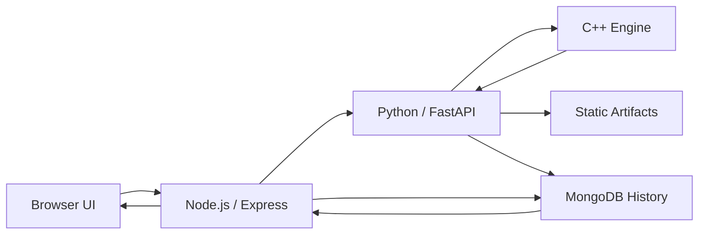
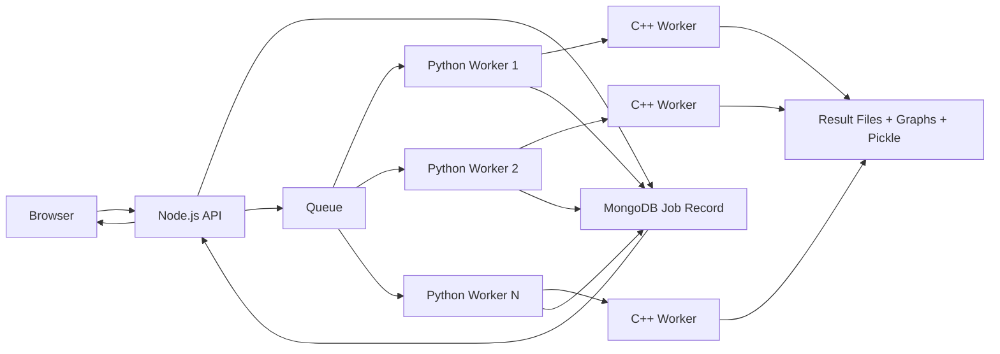
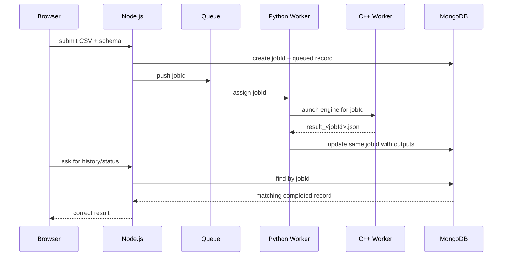
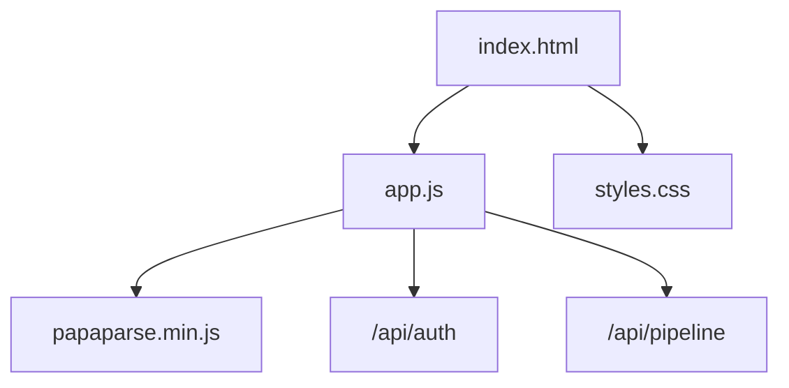
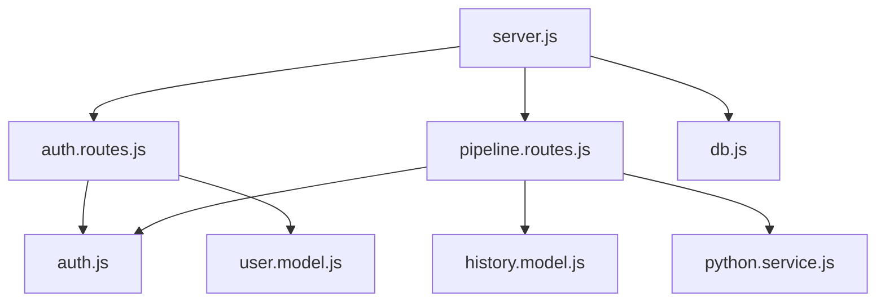
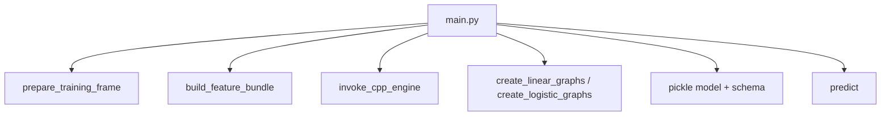
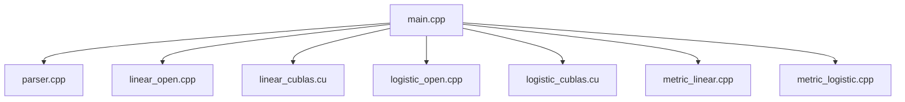
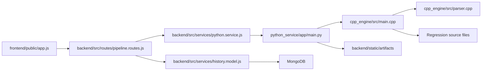

# Project Overview

This file explains the project flow through the codebase, the role of each important file, and the intended queue-based multi-worker architecture.

## 1. Current Implemented Runtime

The current local runtime is the direct flow:

### What happens in the current local version

1. The browser uploads the CSV and the selected schema.
2. Node.js validates the request and stores the CSV in `backend/static/uploads`.
3. Node.js forwards the payload to Python.
4. Python prepares the data, calls the C++ engine, creates graphs, and saves the pickle/artifacts.
5. Node.js stores the final history record in MongoDB.
6. The browser opens the result and can reopen it later from history.

## 2. Intended Queue-Based Architecture

The intended scalable version is:

### Queue idea

- Node.js becomes the request manager.
- Every incoming training request gets a unique `jobId`.
- Node.js stores the job in MongoDB with a status like `queued`.
- Node.js pushes the job into a queue.
- One free Python worker takes the next job.
- That Python worker starts one C++ worker process for that job.
- When the job finishes, the same `jobId` is used to mark the result as completed.

## 3. How Node.js Matches The Correct Output

Node.js should match outputs by `jobId`, not by worker number.

### Why this works

- `jobId` is unique for each request.
- The same `jobId` travels through Node.js, Python, C++, MongoDB, and artifact filenames.
- So even if many workers run together, the result is still tied to the correct request.

## 4. How Multiple Python Workers Are Created

In the local runner, only one Python process is started.

For the intended scalable version, multiple Python workers can be created in two common ways:

1. Run FastAPI/Uvicorn with multiple workers.
2. Run multiple Python queue-consumer processes.

Conceptually:

- Worker 1 picks job A
- Worker 2 picks job B
- Worker 3 picks job C

Each worker is independent, but all of them write back using the correct `jobId`.

## 5. How Multiple C++ Workers Are Created

The native worker is job-based.

- A Python worker receives one job.
- That Python worker launches one C++ process for that job.
- If 4 Python workers are active, up to 4 C++ worker processes can exist at the same time.

That means:

- Python handles orchestration concurrency.
- C++ handles computation concurrency.

The real limit depends on:

- CPU cores
- RAM
- disk speed
- GPU scheduling limits

## 6. Frontend File Flow

### Frontend files

- `frontend/public/index.html`
  Main page layout. Contains the login/register area, upload area, history area, result area, and footer watermark.
- `frontend/public/styles.css`
  Handles the centered layout, table scrolling, forms, cards, and overall UI styling.
- `frontend/public/app.js`
  Main frontend logic. Parses CSVs, infers datatypes, builds the column-role UI, calls backend APIs, renders history, graphs, metrics, and manual prediction.
- `frontend/public/papaparse.min.js`
  CSV parser library used in the browser.

## 7. Backend File Flow

### Backend files

- `backend/src/server.js`
  Entry point. Loads env files, connects MongoDB, configures Express, sessions, rate limiting, static paths, auth routes, pipeline routes, and LAN binding.
- `backend/src/middleware/auth.js`
  Creates JWT auth payloads, saves session data, and protects private routes.
- `backend/src/routes/auth.routes.js`
  Handles register, login, logout, and session restore endpoints.
- `backend/src/routes/pipeline.routes.js`
  Handles CSV upload, calls Python, stores history, returns history, deletes history, and forwards prediction requests.
- `backend/src/services/db.js`
  MongoDB connection and health tracking.
- `backend/src/services/user.model.js`
  Mongoose model for users.
- `backend/src/services/history.model.js`
  Mongoose model for saved pipeline runs and results.
- `backend/src/services/python.service.js`
  Small service layer that calls Python `/schedule` and `/predict`.

## 8. Test Note

The source-level backend tests were removed from the final submission so the repo contains only the running application code.

During development, auth-route tests were useful to validate:

- invalid register requests
- successful register responses
- invalid login rejection
- valid login token payloads

Those checks were helpful during development, but the separate test files and Vitest tooling are not part of the final delivered source now.

## 9. Python File Flow

### Python file

- `python_service/app/main.py`
  Single orchestrator file. It:
  - reads the uploaded CSV
  - applies the selected column roles
  - validates the target column
  - prepares the final training frame
  - builds encoding metadata for later prediction
  - chooses CPU/GPU mode
  - launches the native C++ engine
  - computes analysis metrics
  - creates Plotly and Bokeh graphs
  - stores pickle files and output metadata
  - serves manual prediction later

## 10. Native C++ File Flow

### C++ source files

- `cpp_engine/src/main.cpp`
  Native entry point. Reads job JSON, chooses model/hardware path, and writes result JSON.
- `cpp_engine/src/parser.cpp`
  Loads CSV rows into RAM, fills nulls, performs encoding, and builds numeric datasets.
- `cpp_engine/src/linear_open.cpp`
  CPU linear regression training path.
- `cpp_engine/src/linear_cublas.cu`
  GPU linear regression training path.
- `cpp_engine/src/logistic_open.cpp`
  CPU logistic regression training path.
- `cpp_engine/src/logistic_cublas.cu`
  GPU logistic regression training path.
- `cpp_engine/src/metric_linear.cpp`
  Linear regression metrics.
- `cpp_engine/src/metric_logistic.cpp`
  Logistic regression metrics.

### C++ headers

- `cpp_engine/include/parser.hpp`
  Shared data structures and parsing interfaces.
- `cpp_engine/include/linear_open.hpp`
  CPU linear declarations.
- `cpp_engine/include/linear_cublas.hpp`
  GPU linear declarations.
- `cpp_engine/include/logistic_open.hpp`
  CPU logistic declarations.
- `cpp_engine/include/logistic_cublas.hpp`
  GPU logistic declarations.
- `cpp_engine/include/metric_linear.hpp`
  Linear metric declarations.
- `cpp_engine/include/metric_logistic.hpp`
  Logistic metric declarations.

## 11. End-To-End File Journey

## 12. Final Summary

- The browser prepares the schema and interacts with the user.
- Node.js is the API gateway and the correct place to own queueing in the scalable design.
- Python is the orchestration layer and can be scaled with multiple workers.
- C++ is the computation layer and can run multiple worker processes through the Python workers.
- MongoDB stores users, sessions, history, and in the intended design can also store queued/completed job state.
